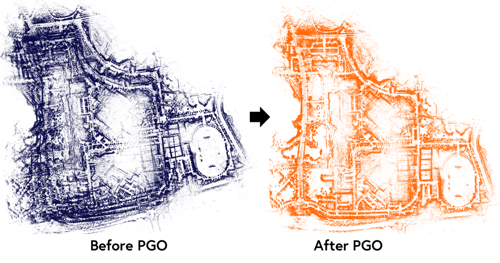

<div align="center">
    <h1>Navtech-Radar-SLAM</h1>
    <a href="https://github.com/gisbi-kim/navtech-radar-slam/tree/main"></a>
    <a href="https://github.com/gisbi-kim/navtech-radar-slam/tree/main"></a>
    <br />
    <br />
    <a href=https://www.youtube.com/watch?v=7ZMPtornIHA>Video</a>
    <span>&nbsp;&nbsp;•&nbsp;&nbsp;</span>
    <a href="https://github.com/gisbi-kim/navtech-radar-slam/tree/main?tab=readme-ov-file#steps">Install</a>
    <span>&nbsp;&nbsp;•&nbsp;&nbsp;</span>
    <a href=https://arxiv.org/abs/2303.01876>Paper (ORORA)</a>
    <span>&nbsp;&nbsp;•&nbsp;&nbsp;</span>
    <a href=https://ieeexplore.ieee.org/abstract/document/8593953>Paper (ScanContext)</a>
  <br />
  <br />
  <p align="center"></p>
</div>

**ORORA-SLAM**: SLAM using [Outlier-robust radar odometry (ORORA)](https://arxiv.org/abs/2303.01876) + [ScanContext-based Loop Closing](https://ieeexplore.ieee.org/abstract/document/8593953)

---

## What is Navtech-Radar-SLAM? 
- In this repository, a (minimal) SLAM problem is defeind as **SLAM = Odometry + Loop closing**, and the optimized states are only robot poses along a trajectory.  
- Based on the above view, this repository aims to integrate current available radar odometry, radar place recognition, and pose-graph optimization. 
    1. Radar odometry: [ORORA open source](https://github.com/url-kaist/outlier-robust-radar-odometry).
        - The odometry modules consumes file-based input (not ROS subscription) in this example. See [here](https://github.com/url-kaist/outlier-robust-radar-odometry/blob/main/src/odometry.cpp) for the details. 
    2. Radar place recognition: [Scan Context open source](https://github.com/irapkaist/scancontext)
        - In MulRan dataset paper, the radar scan context is also proposed, but in this repository we use a Cartesian 2D feature point cloud (extracted via cen2019 method) as an input for the original Scan Context (IROS2018) method and it works. 
        - The Scan Context-based loop detection is included in the file `pgo/SC-A-LOAM/laserPosegraphOptimization.cpp`.
    3. Pose-graph optimization
        - iSAM2 in GTSAM is used. See `pgo/SC-A-LOAM/laserPosegraphOptimization.cpp` for the details (ps. the implementation is eqaul to [SC-A-LOAM](https://github.com/gisbi-kim/SC-A-LOAM) and it means `laserPosegraphOptimization.cpp` node is generic!)
         
---

## How to use? 

### Dependencies 

- ORORA: OpenCV, and SC-PGO: GTSAM 
- Code is tested on Ubuntu 20.04 with ROS Noetic.

### Steps 
First, clone and build. Note, there's a **submodule** in the repository.
```
$ mkdir -p ~/catkin_radarslam/src && cd ~/catkin_radarslam/src
$ git clone https://github.com/gisbi-kim/navtech-radar-slam.git 
$ cd navtech-radar-slam && git submodule init && git submodule update
$ cd ../..
$ catkin_make 
```

Second, 
- [Download a sequence from the MulRan dataset](https://sites.google.com/view/mulran-pr/download) (you need to download polar_oxford_form.zip) 
- Change [this line in the yeti launch](https://github.com/gisbi-kim/navtech-radar-slam/blob/2921851c0735894d38998ca1a2057af2e8abbfd9/odometry/yeti_radar_odometry/launch/yeti_radar_odometry.launch#L4) to your downloaded and unzipped radar data directory path. 

Then, enjoy!
```
$ source devel/setup.bash
$ roslaunch src/navtech-radar-slam/launch/navtech_radar_slam_mulran.launch seq_dir:=${DATA_DIR}
```

For example, 

```
$ roslaunch src/navtech-radar-slam/launch/navtech_radar_slam_mulran.launch seq_dir:="/media/shapelim/UX980/UX960NVMe/mulran-radar/KAIST03"
```

## Examples 
- The examples are from [MulRan dataset](https://sites.google.com/view/mulran-pr/home), which is suitable to evaluate the radar odometry or SLAM algorithm in complex urban sites. 
    - The MulRan dataset provides the oxford-radar-robotcar-radar data format (i.e., meta data such as ray-wise timestamps are imbedded in an radar image, [see details here](https://oxford-robotics-institute.github.io/radar-robotcar-dataset/documentation#radar))


### 1. Recent Result in KAIST 03 of MulRan dataset

<p align="center"></p>

### 2. KAIST 03 of MulRan dataset
- [Video (youtube link)](https://www.youtube.com/watch?v=avtIQ8fesgU&t=107s)  
- Capture:
    <p align="center"></p>

### 3. Riverside 03 of MulRan dataset 
- [Video (youtube link)](https://youtu.be/-wVfbrtlRAI?t=301)  
- Capture:
    <p align="center"></p>

## Related papers 
If you cite this repository, please consider below papers. 
- [ORORA open source](https://github.com/keenan-burnett/yeti_radar_odometry) for radar odometry: 
    ```
    @INPROCEEDINGS { lim-2023-icra,
        author = {Lim, Hyungtae and Han, Kawon and Shin, Gunhee and Kim, Giseop and Hong, Songcheol and Myung, Hyun},
        title = { ORORA: Outlier-robust radar odometry },
        booktitle = { Proceedings of the IEEE International Conference on Robotics and Automation (ICRA) },
        pages={2046--2053},
        year = { 2023 },
    }
    ```
- [Yeti open source](https://github.com/keenan-burnett/yeti_radar_odometry) for radar odometry: 
    ```
    @ARTICLE{burnett_ral21,
        author = {Keenan Burnett, Angela P. Schoellig, Timothy D. Barfoot},
        journal={IEEE Robotics and Automation Letters},
        title={Do We Need to Compensate for Motion Distortion and Doppler Effects in Spinning Radar Navigation?},
        year={2021},
        volume={6},
        number={2},
        pages={771-778},
        doi={10.1109/LRA.2021.3052439}}
    }
    ```
- [Scan Context open source](https://github.com/irapkaist/scancontext) for place recognition: 
    ```
    @INPROCEEDINGS { gkim-2018-iros,
        author = {Kim, Giseop and Kim, Ayoung},
        title = { Scan Context: Egocentric Spatial Descriptor for Place Recognition within {3D} Point Cloud Map },
        booktitle = { Proceedings of the IEEE/RSJ International Conference on Intelligent Robots and Systems },
        year = { 2018 },
        month = { Oct. },
        address = { Madrid }
    }
    ```
- [MulRan dataset](https://sites.google.com/view/mulran-pr/home): 
    ```
    @INPROCEEDINGS{ gskim-2020-mulran, 
        TITLE={MulRan: Multimodal Range Dataset for Urban Place Recognition}, 
        AUTHOR={Giseop Kim and Yeong Sang Park and Younghun Cho and Jinyong Jeong and Ayoung Kim}, 
        BOOKTITLE = { Proceedings of the IEEE International Conference on Robotics and Automation (ICRA) },
        YEAR = { 2020 },
        MONTH = { May },
        ADDRESS = { Paris }
    }
    ```

## TODO
- About utilities 
    - support ROS-based input (topic subscription)
    - support a resulting map save functions.  
- About performances 
    - support reverse loop closing.
    - enhance RS (radius-search) loop closings.
