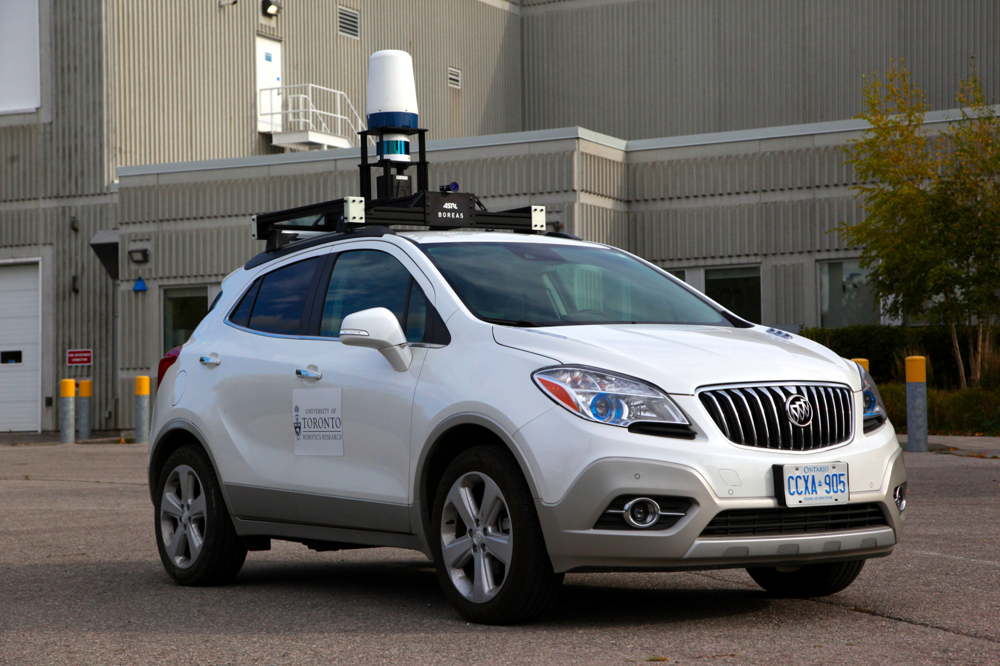
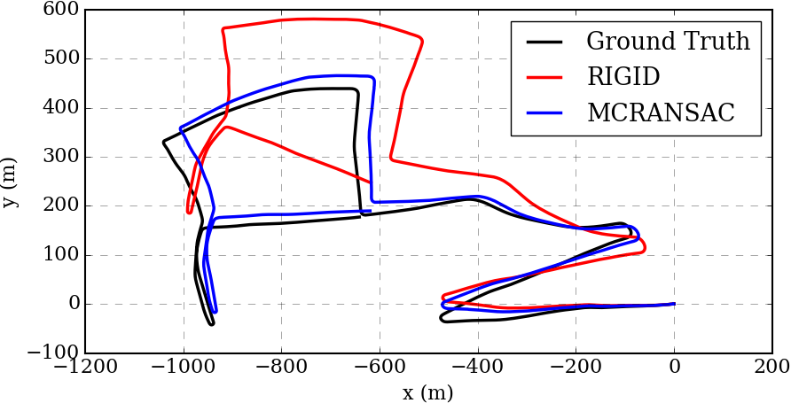

# yeti

This repo contains radar odometry code which removes motion distortion and Doppler effects from Navtech radar data. For our odometry experiments, we use the [Oxford Radar Robotcar Dataset](https://oxford-robotics-institute.github.io/radar-robotcar-dataset/). For our metric localization experiments, we use data taken using our own platform, Boreas, shown below.

## Boreas


## Odometry Performance


If you found this git repository useful in your work, please consider citing our paper which has been accepted towards ICRA/RA-L 2021:

[Do We Need to Compensate for Motion Distortion and Doppler Effects in Spinning Radar Navigation?](https://arxiv.org/abs/2011.03512)

```
@ARTICLE{burnett_ral21,
  author = {Keenan Burnett, Angela P. Schoellig, Timothy D. Barfoot},
  journal={IEEE Robotics and Automation Letters},
  title={Do We Need to Compensate for Motion Distortion and Doppler Effects in Spinning Radar Navigation?},
  year={2021},
  volume={6},
  number={2},
  pages={771-778},
  doi={10.1109/LRA.2021.3052439}}
}
```

## Build Instructions

Dependencies:

```
Eigen 3.3
Boost 1.5.8
OpenCV 3.3
```

Note: I have only tested that this code compiles on Ubuntu 16.04, but it should compile for newer versions of Ubuntu.

Note: we provide a Dockerfile which can be used to build a docker image with all the required deps already installed.

These build instructions assume you are building your project using a catkin workspace with catkin build.

Building yeti:

```
mkdir -p \~/yeti_ws/src/ && cd \~/yeti_ws/src
git clone https://github.com/keenan-burnett/yeti.git
cd .. && catkin build
```

## Examples

`odometry.cpp` This program performs radar odometry and saves the output from the rigid estimator, motion-compensated, and motion+doppler compensated estimators.

This example relies on the [Oxford Radar Robotcar Dataset](https://oxford-robotics-institute.github.io/radar-robotcar-dataset/).

If you want to get started quickly, download their sample sequence. Note that the path to where your Oxford data is stored is hard-coded.

Example usage:
```
./build/yeti/odometry <sequence_name>
```

`localization.cpp` This program peforms metric localization between radar scans collected in opposite directions. This example relies data taken from our own platform, Boreas.

In order to access our S3 bucket, you'll need to fill out this [google form](https://forms.gle/ZGtQhKRXkxmcAGih9) and wait a few days for our response:

Dowload some example data for this using this script (54 GB):

```
scripts/download_data.sh
```

Note that you'll need to be set up with an AWS S3 account and have their CLI installed.

Example usage: (Note that the location of your data and the ground truth csv is hard-coded for now.)
```
./build/yeti/localization
```

`showcase_distortion.cpp` This program is meant to showcase the motion distortion and Doppler distortion in the radar data. We remove motion distortion from lidar points and draw them onto the Cartesian radar image. In one image we have left in the motion distortion and Doppler distortion from the radar scan, in the other we have removed. This program can be used to get an intuitive understanding for the distortion effects. This program uses data taken on our own platform, Boreas. Download instructions are given above.

## Libraries
We have written a few libraries, which may be useful to others:

`association.cpp` This library provides our implementation of rigid RANSAC to estimate the pose between two 2D or 3D pointclouds with noisy correspondences. The library also contains our implementation of motion-compensated RANSAC which provides a method for compensating for Doppler effects.

`features.cpp` This library contains efficient implementations of Sarah Cen's 2018 and 2019 feature extraction methods.

`radar_utils.cpp` This library provides utilities for working with the Oxford Radar Dataset as well as our own data format. We also provide methods for converting between Polar and Cartesian data representations.
